# EXP01：Linux无人值守安装实验

## 前期准备

**实验准备要素：**

纯净Ubuntu20.04-live-server版本镜像

**实验环境：**

Oracle VM VirtualBox 6.1

## 实验步骤：

本实验通过live-server版本的Ubuntu系统先行手动安装之后，通过已安装好的虚拟机制作无人值守iso镜像，最后达到无人值守安装Linux的效果。

#### 一、手动安装：

**1.下载镜像：**

（1）找到一个快速下载的镜像：

首先我们要下载一个纯净版本的Ubuntu20.04-live-server镜像。最优选择来自于官方的镜像，因为这样既可以保证安全性也能保证各项实验步骤不会出错。

当然，官网的下载大概率会出现下载极度缓慢的情况，这时候我们可以选择找到官方认可支持的国内镜像网站来获取较快的下载速度。

我们可以在 [这里](https://launchpad.net/ubuntu/+cdmirrors) 找到适合你自己地区的镜像发布者，然后选择我们所需要的版本下载。

（2）查验下载镜像的hash：

虽然镜像来源是官方认可的，但以防万一，我们仍旧应当对镜像的完整性进行hash校验。

如果你是Windows系统，那么通过crtl+x叫出面板选择powershell ，并在其中输入

```
Get-FileHash 你存放下载的iso镜像的路径
```

以获得相应的hash值，然后在http://releases.ubuntu.com中找到相应的版本（这里是20.04.2）的[SHA256SUMS](http://releases.ubuntu.com/20.04.2/SHA256SUMS) 进行比对确认。

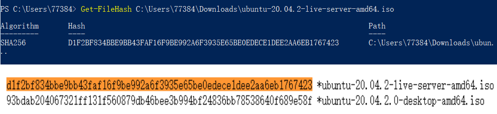

对比无误则可开始下一步的安装

**2.虚拟机设置**

本实验对虚拟机无其他更多的要求，于是除名称和虚拟机位置外，基本选择默认选项。

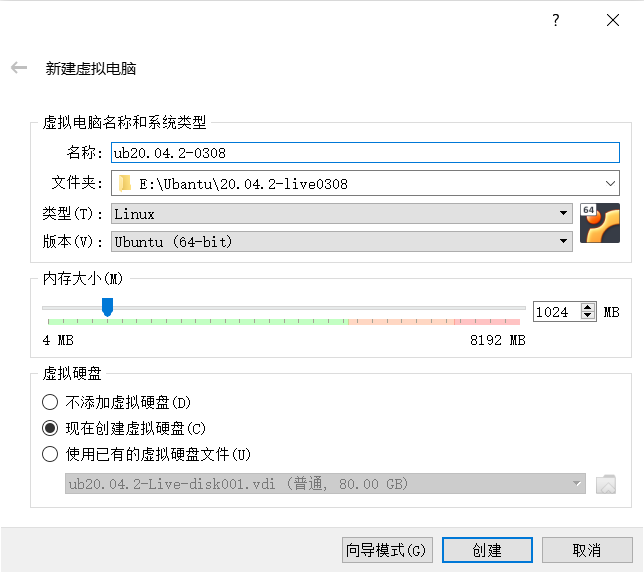

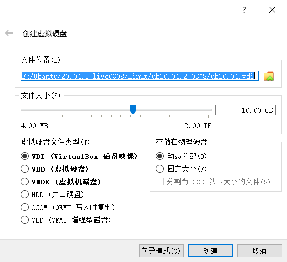

虚拟机创建完成后，为了后面步骤中方便使用ssh，我们打开新生成的虚拟机设置，选择网络，点开网卡2并设置为host-only

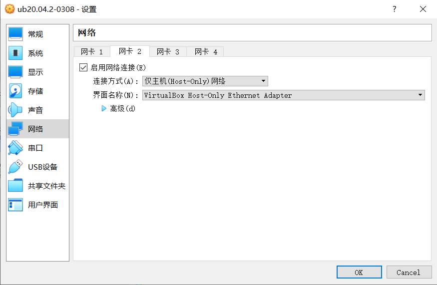

然后，我们在 存储--控制器：IDE 中添加镜像盘片

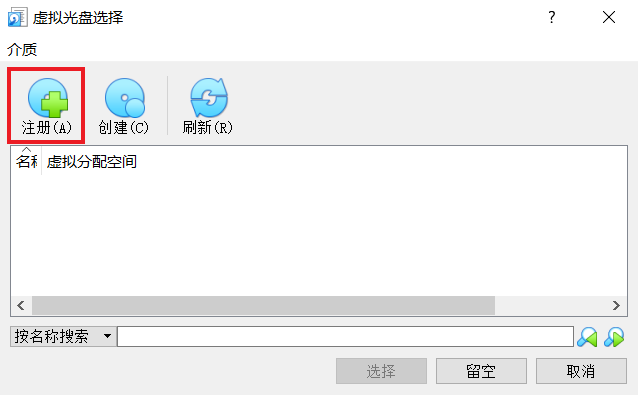

找到自己存储20.04 iso镜像的位置添加

**3.手动安装**

同样，进入手动安装界面后，在无其他需求的情况下都选择默认。

为了后面安装软件加速，我们选择在安装软件源（如下图：Configure Ubuntu archive mirror环节）的时候，输入国内源（此处是阿里源，也可用清华源），以防后面安装缓慢且软件安装因为网络超时的原因失败

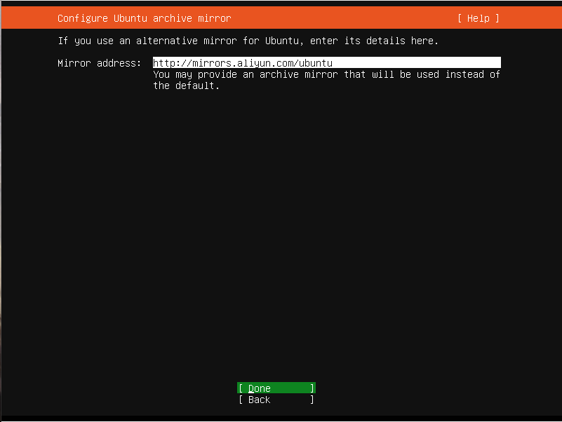

后续继续选择默认，并进入用户设定阶段。

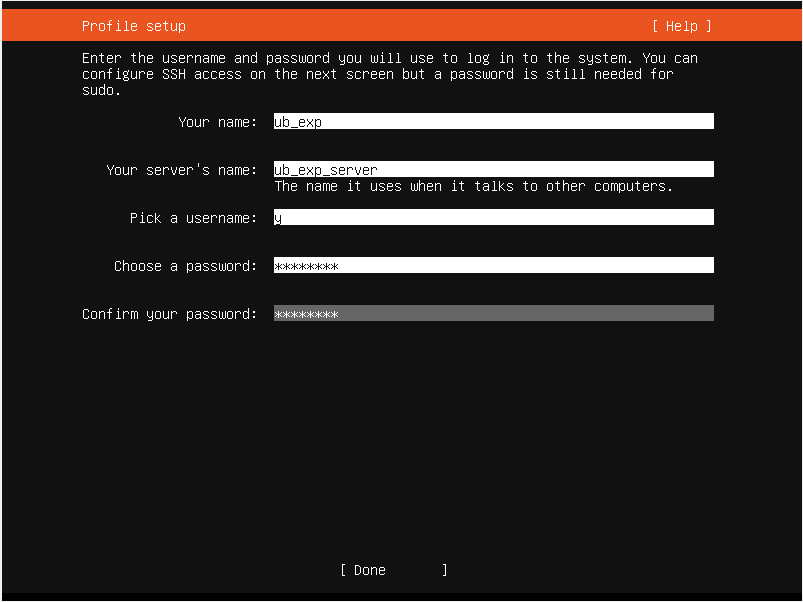

username 是我们进入系统登陆的名称，password则是自己设定的密码。

继续安装默认，直到ssh安装环节，我们要勾选安装OpenSSH server的选项，如图。

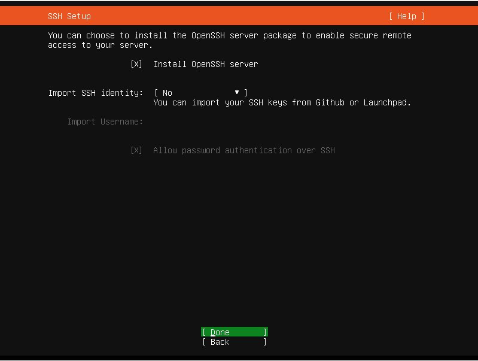

继续点击选项，等待安装完成（当下方第二选项变成“Reboot now”的时候即可），点击reboot now重启

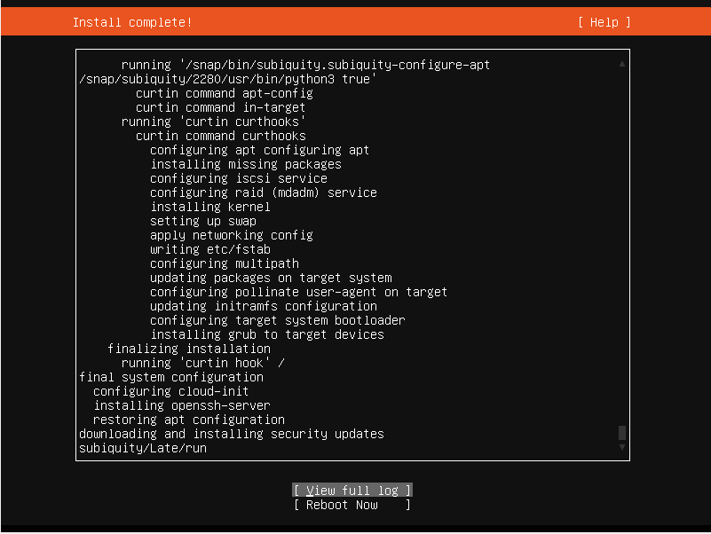

等待重启完成出现以下界面代表手动安装完成。

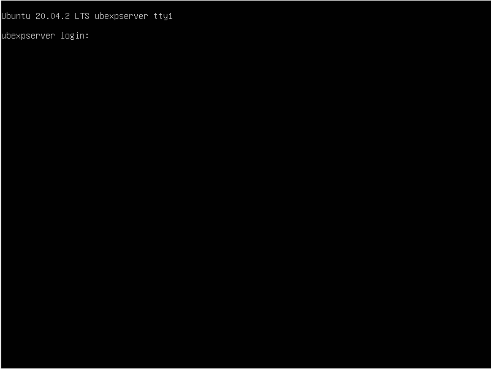

**二、制作自动安装镜像**

（1）修改user-data

首先我们要找到存在于系统当中的autoinstall-user-data：`/var/log/installer/autoinstall-user-data`

在命令中输入：

```
cd /var/log/installer/
cat autoinstall-user-data
```

此时可能出现Permission denied的情况

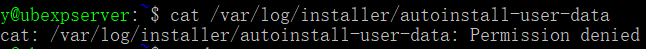

这代表我们现在权限不够，输入

```
sudo su -
```

并在提示的指示下再次输入密码来获得root权限。

再次输入`cat autoinstall-user-data`就可以看到该文件了。为了方便修改，我们通过以下代码改变权限`sudo chow 用户名:用户名 /var/log/installer/autoinstall-user-data`

然后我们打开cmd，将该文件拷贝到主机中： [ip查询方法](https://github.com/c4pr1c3/LinuxSysAdmin/blob/master/chap0x01.exp.md)

```
scp 用户名@第二网卡的ip:/var/log/installer/autoinstall-user-data ./
```

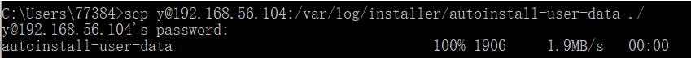

然后用VScode将其打开并修改。前后具体差别详见：asserts中autoinstall-user-data（改前）和user-data（改后）的区别。

最重要的修改即为中：

```
 - {ptable: gpt, serial: VBOX_HARDDISK_VB13be1945-26a623a3, path: /dev/sda, wipe: superblock,
      preserve: false, name: '', grub_device: true, type: disk, id: disk-sda}
```

将`serial: VBOX_HARDDISK_VB13be1945-26a623a3,`代码块删除

完成修改user-data后，通过在cmd中输入下方

```
scp 文件路径 用户名@ip地址:传输后的目标文件路径
```

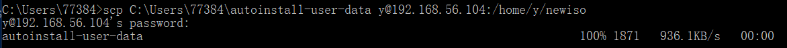

回传user-data给虚拟机

（2）制作镜像：

找到回传的user-data文件（本次采用的是在 `/home/用户名/` 目录下新建 `newiso`目录 存放user-data）

并在同一目录下生成名为meta-data文件：`touch meta-data`

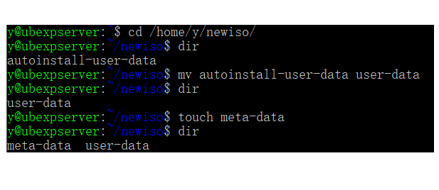

然后安装genisoimage包：

```
sudo apt install genisoimage
```

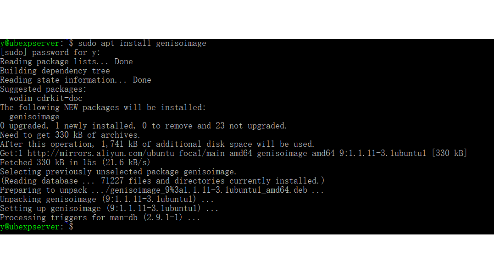

等待安装完毕之后输入

```
genisoimage -output init.iso -volid cidata -joliet -rock user-data meta-data
```

制作镜像

如果之前修改的user-data中有增改编码UTF-8，则输入以下代码制作镜像

```
genisoimage -input-charset utf-8 -output init.iso -volid cidata -joliet -rock user-data meta-data
```

镜像制作完成：

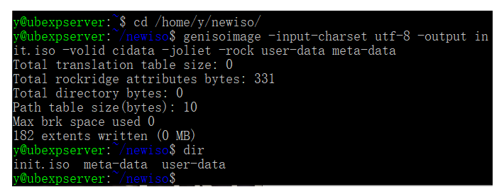

之后再通过前文的方法将新生成的iso文件回传给主机。

（3）无人值守安装

同样地新建一个虚拟机，然后存储设置中选择删除 控制器：IDE ，

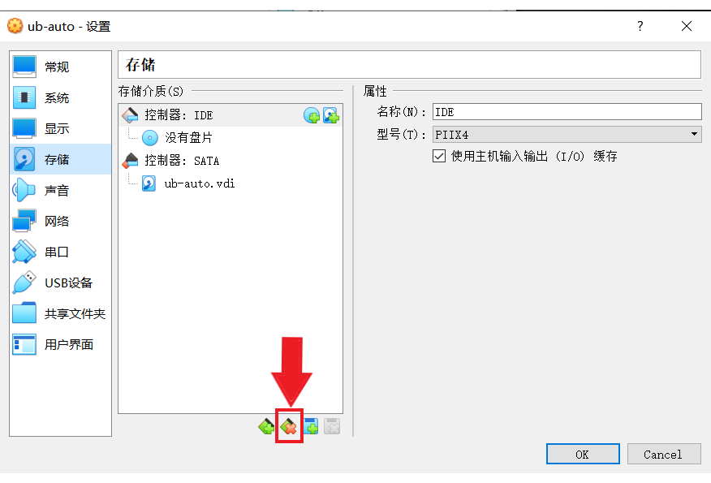

并在 控制器：SATA中有序地先后添加 `Ubuntu20.04-live-server.iso` 和我们刚刚生成的 iso文件

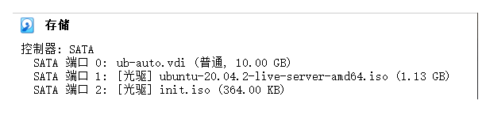

然后打开该虚拟机，启动时可能会出现选择盘片的选项，建议直接点取消进入安装。

正常情况下虚拟机会对我们的文件进行检查，检查完毕之后将会出现下图的确认提示：

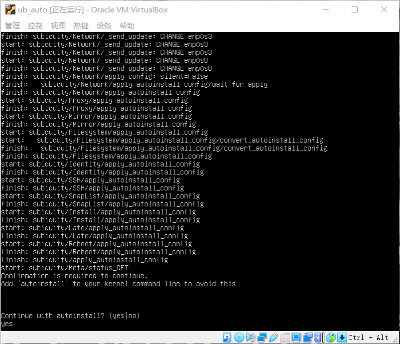

此时输入yes即可继续安装。若未出现yes判断，那么有可能是user-data的建立修改过程出现了不合规定的情况，需要重新制作iso文件。

最后等待安装成功进入手动安装成功一样的界面：

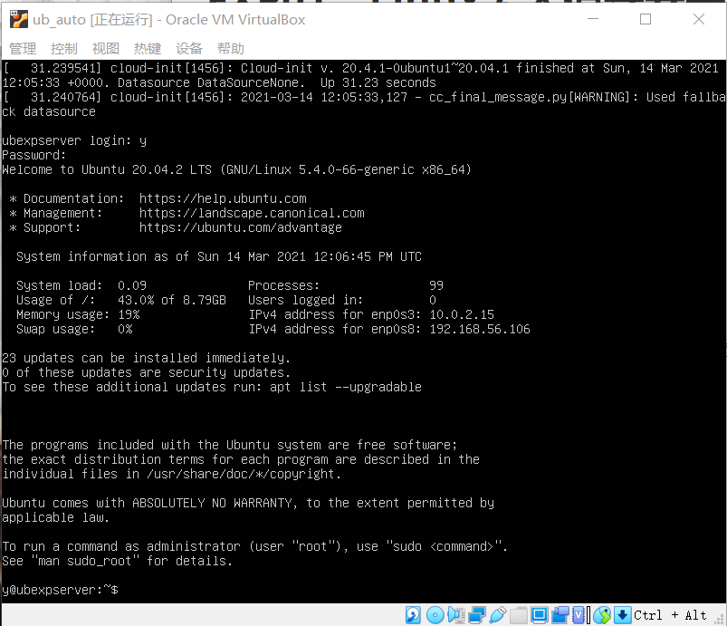


## 参考文献

 [番外章节 Cloud-Init 实验](https://github.com/c4pr1c3/LinuxSysAdmin/blob/master/exp/cloud-init/docker-compose/README.md)

[第一章：Linux基础（实验）](https://github.com/c4pr1c3/LinuxSysAdmin/blob/master/chap0x01.exp.md#%E7%AC%AC%E4%B8%80%E7%AB%A0linux%E5%9F%BA%E7%A1%80%E5%AE%9E%E9%AA%8C)

[Ubuntu 20.04 + Autoinstall + VirtualBox](https://gist.github.com/bitsandbooks/6e73ec61a44d9e17e1c21b3b8a0a9d4c)