# 第四章：shell脚本编程基础（实验）

### 实验内容

------

- 任务一：用bash编写一个图片批处理脚本，实现以下功能：
  
  - 支持命令行参数方式使用不同功能
  
  - 支持对指定目录下所有支持格式的图片文件进行批处理
  
  - 支持以下常见图片批处理功能的单独使用或组合使用
    - 支持对jpeg格式图片进行图片质量压缩
    
      压缩前：
    
      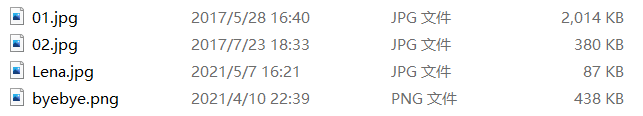
    
      压缩操作执行正常：
    
      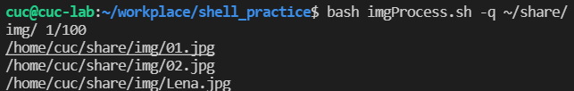
    
      完成压缩操作：
    
      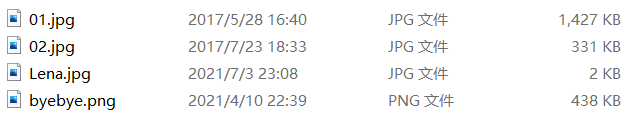
    
      
    
    - 支持对jpeg/png/svg格式图片在保持原始宽高比的前提下压缩分辨率
    
      还是同样的图片，`bash imgProcess.sh -r ~/share/img/ 100` 进行缩放操作
    
      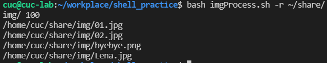
    
      大小同样发生变化，图片原始宽高比保持不变，详见 `processed_image\resized`
    
      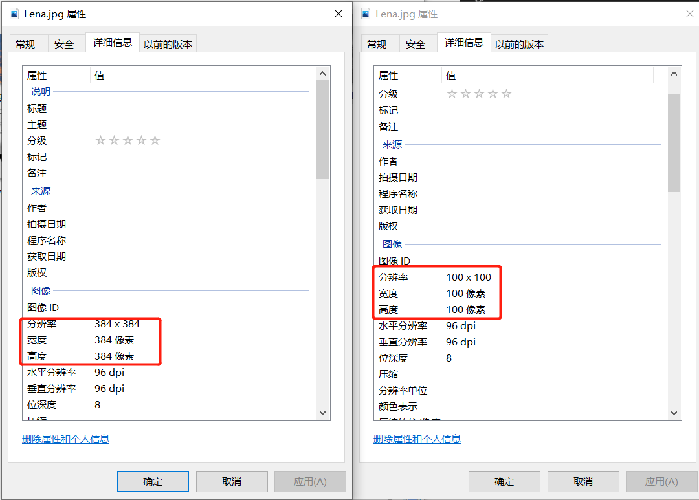
    
      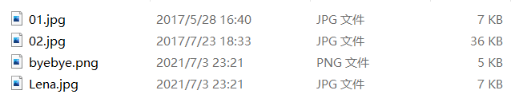
    
    - 支持对图片批量添加自定义文本水印
    
      脚本执行如下，具体水印添加情况详见仓库： `processed_image\watermark`
    
      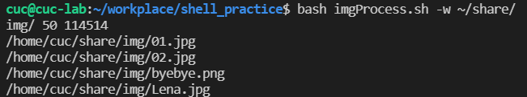
    
    - 支持批量重命名（统一添加文件名前缀或后缀，不影响原始文件扩展名）：
    
      `bash imgProcess.sh -p ~/share/img/ new`  将图片名称增加上相应的 **new** 前缀
    
      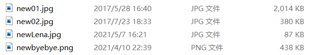
    
      `bash imgProcess.sh -s ~/share/img/ new`  将图片后缀增加相应的 **new** 后缀
    
      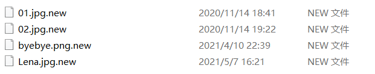
    
    - 支持将png/svg图片统一转换为jpg格式图片
    
      转换前：
    
      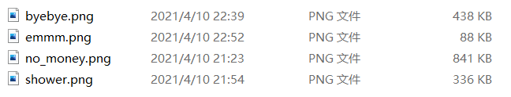
    
      `bash imgProcess.sh -b ~/share/img/` 转换后：
    
      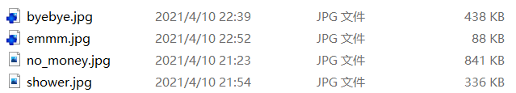

------

- 任务二：用bash编写一个文本批处理脚本，对以下附件分别进行批量处理完成相应的数据统计任务：
  - 2014世界杯运动员数据
    - 统计不同年龄区间范围（20岁以下、[20-30]、30岁以上）的球员**数量**、**百分比**
    
      <20     9       1.222826%
      [20,30] 600     81.521739%
    
      30     127     17.255435%
    
    - 统计不同场上位置的球员**数量**、**百分比**
    
          Défenseur   1       0.135870%
         Midfielder   268     36.413043%
           Defender   236     32.065217%
            Forward   135     18.342391%
             Goalie      96      13.043478%
    
    - 名字最长的球员是谁？名字最短的球员是谁？
    
         The longest name is Lazaros Christodoulopoulos
         The longest name is Francisco Javier Rodriguez
         The longest name is Liassine Cadamuro-Bentaeba
         The shortest name is Jô
    
    - 年龄最大的球员是谁？年龄最小的球员是谁？
    
         The oldest age is 42,the name is        Faryd Mondragon
         The youngest age is 18,the name is      Luke Shaw & Fabrice Olinga
    
    * 结果图：
    
    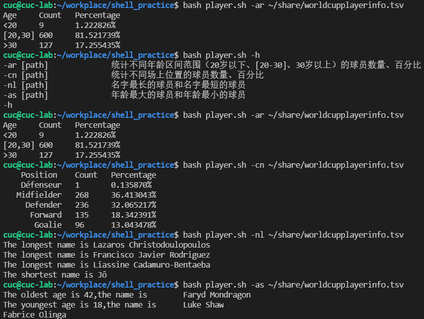

------

- 任务二：用bash编写一个文本批处理脚本，对以下附件分别进行批量处理完成相应的数据统计任务：
  - Web服务器访问日志
    - 统计访问来源主机TOP 100和分别对应出现的总次数
    
    - 统计访问来源主机TOP 100 IP和分别对应出现的总次数
    
    - 统计最频繁被访问的URL TOP 100
    
    - 统计不同响应状态码的出现次数和对应百分比
    
    - 分别统计不同4XX状态码对应的TOP 10 URL和对应出现的总次数
    
    - 给定URL输出TOP 100访问来源主机
    
      

这一部分的内容过多，详见： [任务2-2数据](data/savingdata.md)

------

### 参考目录

------

* [linux-2020-AlinaZxy](https://github.com/CUCCS/linux-2020-AlinaZxy/tree/homework4)
* [imagemagick——帮助文档](https://imagemagick.org/index.php)